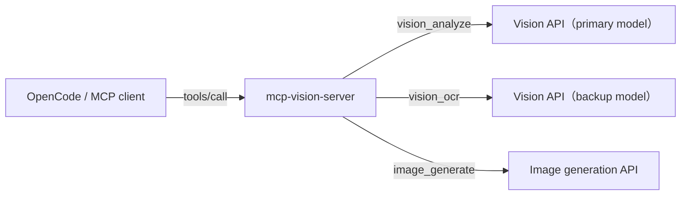

# mcp-vision-server

[English](README.md) | [简体中文](README.zh-CN.md)

> An enhanced fork of [goehou/Visual-Enhancement-mcp](https://github.com/goehou/Visual-Enhancement-mcp) (MIT) that gives your AI assistant **eyes and a brush** — understand images, read text, and generate pictures through any OpenAI-compatible API.

---

## What it does

Three tools, each with a clear job:

| Tool | When you need to... | Example |
| --- | --- | --- |
| `vision_analyze` | understand an image | "What does this error screenshot mean?" |
| `vision_ocr` | copy text verbatim from an image | "Extract the text from this receipt" |
| `image_generate` | create an image from text | "Generate a corgi wearing a hat" |

Pick any image source: local path / URL / pasted attachment.

---

## Quick start

```bash
npm install && npm run build
```

Register it in your OpenCode global config:

```json
{
  "mcp": {
    "vision": {
      "type": "local",
      "command": ["mcp-vision-server"],
      "environment": {
        "VISION_API_BASE_URL": "https://your-api.example.com",
        "VISION_API_KEY": "sk-...",
        "VISION_MODEL": "your-vision-model",
        "IMAGE_API_BASE_URL": "https://your-api.example.com",
        "IMAGE_API_KEY": "sk-...",
        "IMAGE_MODEL": "your-image-model"
      },
      "enabled": true
    }
  }
}
```

> Save, then **start a new session** — the model picks the right tool automatically.

---

## How it works



Vision (looking) and image generation (drawing) are **two independent pipelines**, each with its own endpoint and model.

---

## Usage examples

Just say it in a session — the model routes to the right tool:

```
You: Extract the text from /screenshots/error.png
Model: -> calls vision_ocr -> returns the raw text

You: Describe the layout of this image and analyze it
Model: -> calls vision_analyze -> returns a description

You: Draw a cyberpunk cat
Model: -> calls image_generate -> returns the image
```

---

## Configuration

Model priority:

```
model passed in a call  >  per-tool model  >  global default model
```

### Vision (look / read)

| Env var | Description | Default |
| --- | --- | --- |
| `VISION_API_BASE_URL` | Vision API root URL | required |
| `VISION_API_KEY` | Vision API key | required |
| `VISION_MODEL` | Default vision model | required |
| `VISION_ANALYZE_MODEL` | Dedicated model for `vision_analyze` | falls back to `VISION_MODEL` |
| `VISION_BACKUP_API_BASE_URL` | Backup vision platform URL for `vision_ocr` | falls back to `VISION_API_BASE_URL` |
| `VISION_BACKUP_API_KEY` | Backup vision key | falls back to `VISION_API_KEY` |
| `VISION_BACKUP_MODEL` | Backup vision model | falls back to `VISION_MODEL` |
| `VISION_TIMEOUT_MS` | Request timeout (ms) | `60000` |
| `VISION_MAX_TOKENS` | Output token cap | `4096` |

> **Tip**: `VISION_BACKUP_*` lets you point `vision_ocr` at a **different platform or a faster model** as a backup. Leave them unset and everything shares the main vision config.

### Image generation (draw)

| Env var | Description | Default |
| --- | --- | --- |
| `IMAGE_API_BASE_URL` | Image generation API root URL | falls back to `VISION_API_BASE_URL` |
| `IMAGE_API_KEY` | Image generation key | falls back to `VISION_API_KEY` |
| `IMAGE_MODEL` | Image model | falls back to `VISION_MODEL` |
| `IMAGE_API_PATH` | Generation request path | `/v1/images/generations` |
| `IMAGE_TIMEOUT_MS` | Generation timeout (ms) | `120000` |

> You can also pass `model` in a call to switch to a backup generation model on the fly.

---

## Upstream API format

`vision_analyze` and `vision_ocr` use the standard OpenAI Chat Completions interface (`POST /v1/chat/completions`); images are sent as `image_url` content blocks and the response is parsed from `choices[0].message.content`.

`image_generate` uses the OpenAI Images API (`POST /v1/images/generations`); the response may contain `data[].b64_json` (inline base64) or `data[].url` (downloaded and converted to base64). Supports `n` (multiple images), `size`, and `response_format` parameters.

---

## Changes vs the original project

- **New `image_generate` tool**: generates via `/v1/images/generations`; supports multiple images, size, and model override; returns base64 or download URL.
- **New backup vision endpoint** `VISION_BACKUP_*`: OCR can use a different platform or a faster model.
- **New `VISION_ANALYZE_MODEL`**: analyze and ocr can each use their own model.
- **Improved tool descriptions**: reworded to help the model distinguish "understanding" from "extraction".
- **Robustness**: every generated image is returned; hardened URL download (http/https only, timeout, size cap, type check); `imageBase64` size cap; truncated error messages; server starts even without keys.
- **Tests**: 17 new unit tests added, 64 total — all passing.

---

## FAQ

<details>
<summary><b>Why does vision_ocr use a "backup vision model" instead of a dedicated OCR model?</b></summary>

OCR is fundamentally a vision-model task — a faster vision model works perfectly as the OCR backup. If you later want a dedicated OCR platform, just point `VISION_BACKUP_*` at it.
</details>

<details>
<summary><b>The image generation API is unreachable?</b></summary>

Some generation API domains require a proxy to reach. Make sure the proxy is available; vision APIs generally work over direct connections.
</details>

<details>
<summary><b>My image generation platform uses an async task API — what then?</b></summary>

This server expects a standard OpenAI synchronous interface (one request = one image back). If your platform returns a task ID that must be polled, it is currently not compatible — switch to a platform that supports the synchronous endpoint.
</details>

<details>
<summary><b>Will deleting the source directory break things?</b></summary>

No. The globally installed copy lives under the npm global root; the source directory is only for development.
</details>

---

## Development & testing

```bash
npm install
npm run build     # tsc to dist/
npm run test      # unit tests
npm run lint      # ESLint
```
