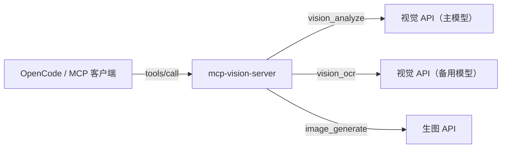

# mcp-vision-server

[English](README.md) | [简体中文](README.zh-CN.md)

> 基于 [goehou/Visual-Enhancement-mcp](https://github.com/goehou/Visual-Enhancement-mcp)（MIT）的增强版，给 AI 助手装上「眼睛 + 画笔」——**看图、识字、生图**，接入任意 OpenAI 兼容 API。

---

## 它能做什么

三个工具，各司其职：

| 工具 | 当你需要…… | 一句话场景 |
| --- | --- | --- |
| `vision_analyze` | 理解一张图 | 「这个报错截图是什么问题？」 |
| `vision_ocr` | 把图里的字原样抠出来 | 「把这张发票的文字提取出来」 |
| `image_generate` | 凭空画一张图 | 「生成一只戴帽子的柴犬」 |

图片来源三种随便挑：本地路径 / URL / 直接贴图。

---

## 快速开始

```bash
npm install && npm run build
```

在 OpenCode 全局配置中注册：

```json
{
  "mcp": {
    "vision": {
      "type": "local",
      "command": ["mcp-vision-server"],
      "environment": {
        "VISION_API_BASE_URL": "https://your-api.example.com",
        "VISION_API_KEY": "sk-...",
        "VISION_MODEL": "your-vision-model",
        "IMAGE_API_BASE_URL": "https://your-api.example.com",
        "IMAGE_API_KEY": "sk-...",
        "IMAGE_MODEL": "your-image-model"
      },
      "enabled": true
    }
  }
}
```

> 保存后**重开一个会话**，模型会自动识别并选对工具。

---

## 工作方式



视觉（看图）与生图（画画）是**两条独立链路**，各自用自己的端点和模型，互不影响。

---

## 使用示例

在会话里这样说，模型会自己调对工具：

```
我：把 E:\截图\报错.png 的文字提取出来
模型：→ 调用 vision_ocr → 返回原文

我：这张图画的什么？帮我分析下布局
模型：→ 调用 vision_analyze → 返回描述

我：画一张赛博朋克风格的猫
模型：→ 调用 image_generate → 返回图片
```

---

## 配置详解

模型选择优先级：

```
调用时传 model  >  工具专用模型  >  全局默认模型
```

### 视觉通道（看图 / 识字）

| 环境变量 | 说明 | 默认值 |
| --- | --- | --- |
| `VISION_API_BASE_URL` | 视觉 API 根地址 | 必填 |
| `VISION_API_KEY` | 视觉 Key | 必填 |
| `VISION_MODEL` | 默认视觉模型 | 必填 |
| `VISION_ANALYZE_MODEL` | `vision_analyze` 专用模型 | 回退 `VISION_MODEL` |
| `VISION_BACKUP_API_BASE_URL` | `vision_ocr` 的备用视觉平台地址 | 回退 `VISION_API_BASE_URL` |
| `VISION_BACKUP_API_KEY` | 备用视觉 Key | 回退 `VISION_API_KEY` |
| `VISION_BACKUP_MODEL` | 备用视觉模型 | 回退 `VISION_MODEL` |
| `VISION_TIMEOUT_MS` | 请求超时（毫秒） | `60000` |
| `VISION_MAX_TOKENS` | 输出上限 | `4096` |

> **提示**：`VISION_BACKUP_*` 可以把 `vision_ocr` 指到**不同的平台或更快的模型**，当备用视觉模型用；不设则完全共用主视觉配置。

### 生图通道（画画）

| 环境变量 | 说明 | 默认值 |
| --- | --- | --- |
| `IMAGE_API_BASE_URL` | 生图 API 根地址 | 回退 `VISION_API_BASE_URL` |
| `IMAGE_API_KEY` | 生图 Key | 回退 `VISION_API_KEY` |
| `IMAGE_MODEL` | 生图模型 | 回退 `VISION_MODEL` |
| `IMAGE_API_PATH` | 生图请求路径 | `/v1/images/generations` |
| `IMAGE_TIMEOUT_MS` | 生图超时（毫秒） | `120000` |

> 生图也支持调用时传 `model` 参数，随时切换到备用模型。

---

## 上游 API 格式

`vision_analyze` / `vision_ocr` 调用的是标准 OpenAI Chat Completions 接口（`POST /v1/chat/completions`），图片以 `image_url` 内容块发送，响应解析 `choices[0].message.content`。

`image_generate` 调用的是 OpenAI Images API（`POST /v1/images/generations`），响应 `data[].b64_json`（内联 base64）或 `data[].url`（下载后转 base64）。支持 `n`（多张）、`size`、`response_format` 参数。

---

## 相比原项目改了什么

- **新增生图工具** `image_generate`：通过 `/v1/images/generations` 生成，支持多张 / 尺寸 / 模型覆盖，返回 base64 或下载 URL。
- **新增备用视觉端点** `VISION_BACKUP_*`：OCR 可走不同平台或更快的模型。
- **新增 `VISION_ANALYZE_MODEL`**：analyze 与 ocr 可各用各的模型。
- **工具描述优化**：场景化改写，帮模型区分「理解」与「提取」。
- **健壮性增强**：多图真正全返回、生图 URL 下载加固（仅 http/https、超时、大小限制、类型校验）、`imageBase64` 大小上限、错误信息截断、空配置时 server 也可启动。
- **测试**：新增 17 项单测，总计 64 项全绿。

---

## 常见问题

<details>
<summary><b>为什么 vision_ocr 用的是「备用视觉模型」而不是专用 OCR 模型？</b></summary>

OCR 本质也是视觉模型，用一个更快的视觉模型当 OCR 备用即可，没必要另起炉灶。如果以后想接专用 OCR 平台，把 `VISION_BACKUP_*` 指过去就行。
</details>

<details>
<summary><b>生图接口连不上？</b></summary>

某些生图 API 域名需要代理才能访问。确认代理可用后再试；视觉 API 一般直连即可。
</summary></details>

<details>
<summary><b>生图用的是异步任务接口怎么办？</b></summary>

本服务走的是标准 OpenAI 同步接口（一次请求即返回图片）。如果你的生图平台是异步模式（返回任务 ID 需要轮询），目前不兼容，需要换一个支持同步接口的生图平台。
</details>

<details>
<summary><b>删掉源码目录会不会丢？</b></summary>

不会。全局安装的副本在 npm 全局目录下，源码目录只是开发用。
</details>

---

## 开发与测试

```bash
npm install
npm run build     # tsc 编译到 dist/
npm run test      # 单元测试
npm run lint      # ESLint
```
